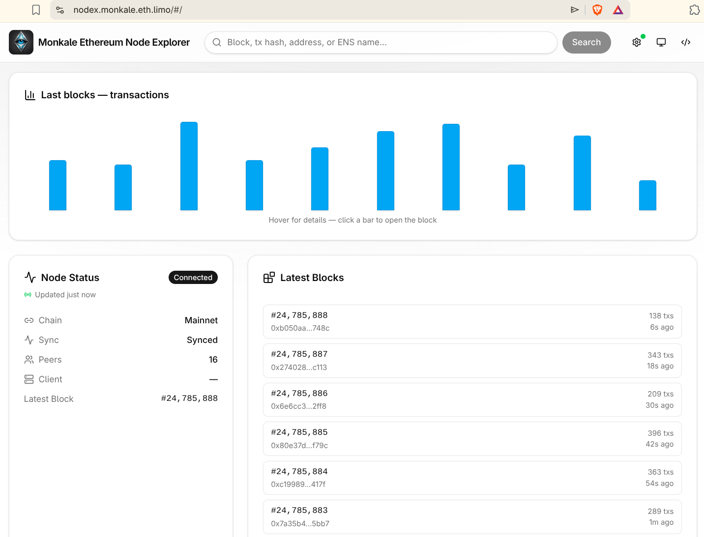
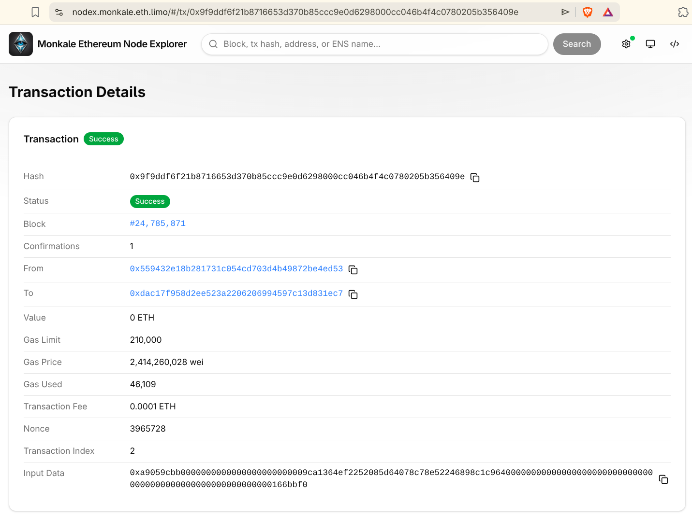
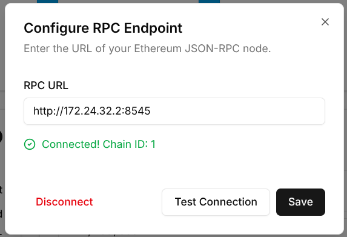

# Monkale Ethereum Node Explorer

## Overview

Light, serverless IPFS-hosted Ethereum explorer app that connects directly to your Ethereum JSON-RPC node. Intended to be fast and handy for Ethereum node runners without the need to run it yourself. 

No backend, no servers, and no required third-party infrastructure: your browser queries the node you configure for chain data. Some optional UX features, such as unknown event signature resolution, can use public metadata services when enabled in settings.

So far the application is capable to browse blocks, transactions, and accounts on any Ethereum-compatible chain.

## How to Use

This explorer is installation-free and serverless by design. The app is a simple `index.html` file shared over the IPFS network, and all logic runs locally in your browser.

You can open it directly in your browser:

- With an ENS-enabled browser: [nodex.monkale.eth](https://nodex.monkale.eth)
- Without ENS support: [nodex.monkale.eth.limo](https://nodex.monkale.eth.limo)

You need direct access to your Ethereum node. After opening the app, choose **Configure RPC Endpoint**, enter your Ethereum JSON-RPC URL, and start exploring blocks, transactions, and accounts.

If you want to compile your own version instead, see [Build instructions](docs/contributing/local-development.md#build).

## Tech Stack

- **React 19** + **TypeScript 5** + **Vite 6**
- **viem** for Ethereum JSON-RPC
- **Tailwind CSS v4** + **shadcn/ui**
- **Zustand** for state
- **React Router v7** (HashRouter for IPFS)
- **Framer Motion** for list / chart micro-animations
- **Vitest** + **Cypress** + **Hardhat** for tests

## Get Envolved

### Contributing

Contributiongs are welcome. Suggest features, solve bugs and more.
Please read docs first. 

- [Local Development](docs/contributing/local-development.md)
- [Contributing Guide](CONTRIBUTING.md)

### IPFS pinning

To make the app always reachable you can help to pin the current version.

Current IPFS CID

`QmdaEJAmEAgGvnAPdpuwJVY97duvR3YDxrgzwwa4vHCSws`

## Contact

* [Email - monkaleio@gmail.com](mailto:monkaleio@gmail.com)
* [Farcaster](https://farcaster.xyz/nikolayz.eth)

## License

This project is licensed under the GNU General Public License v3.0 (GPL-3.0).

Copyright (C) 2026 monkale.io

See `LICENSE` for the full text.
